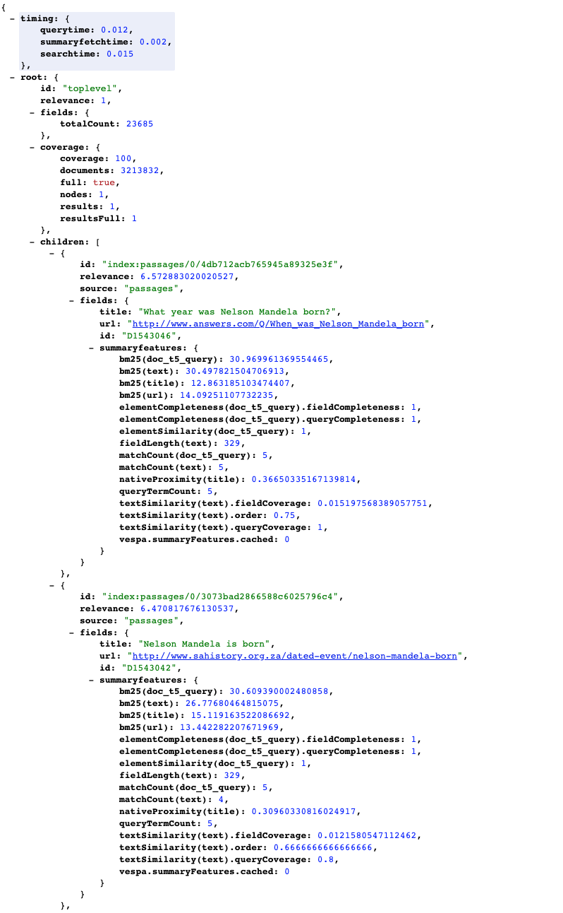

<!-- Copyright Verizon Media. Licensed under the terms of the Apache 2.0 license. See LICENSE in the project root.-->

# Vespa sample application - MS Marco Passage and Document Ranking 

This is work in progress. We will soon publish sample app to reproduce this work.  This is the baseline model for MS Marco Document Ranking. We will add
more Neural Ranking features but this is the first baseline model using traditional lexical ranking.

# Document Schema 

We index all 2.3M documents from [MS Marco](https://microsoft.github.io/msmarco/) Document ranking collection  using the following Vespa schema: 

<pre>
schema doc {

  document doc {

    field title type string {
      indexing: summary | index
      index: enable-bm25
    }

    field text type string {
      indexing: summary | index
      index: enable-bm25
    }

    field url type string {
      indexing: summary | index
      index: enable-bm25
    }

    field id type string {
      indexing: summary |attribute
    }

    #Top-k prediction queries for this doc using T5 https://github.com/castorini/docTTTTTquery
    field doc_t5_query type array&lt;string&gt; {
      indexing: summary | index
      index: enable-bm25
    }
  }
} 
</pre> 
We use the original text fields plus an additional field from docTTTTQuery , see Rodrigo Nogueira and Jimmy Lin. 
[From doc2query to docTTTTTquery.](https://cs.uwaterloo.ca/~jimmylin/publications/Nogueira_Lin_2019_docTTTTTquery-v2.pdf). The authors have published 
their pre-generated model and we use their predictions. We do keep the syntax and index queries as an array instead of a blob of text. 

# Training 

We use the train split to scrape features for traditional LTR. 
For each positive relevant document we sample 50 negatives from the top-k retrieved using a simple 
linear combination of 
bm25 scores for body text, doc_t5_query, title and url. In total 330,302 queries from the training set is used and 16,845,191 total number of data points. 
We use the efficient
[Vespa WeakAnd](https://docs.vespa.ai/documentation/using-wand-with-vespa.html) implementation to retrieve efficiently. 

We handpick 15 features which are generally cheap to compute except nativeProximity but we limit it to the rather short title field. We don't do any type of feature normalization or selection. 

<pre>
rank-profile ltr-scrape {
    first-phase {
      expression: bm25(title) + bm25(text) + bm25(url) + bm25(doc_t5_query)
    }
    summary-features {
      bm25(text)
      bm25(doc_t5_query)
      bm25(title)
      bm25(url)
      queryTermCount
      matchCount(text)
      fieldLength(text)
      textSimilarity(text).fieldCoverage
      textSimilarity(text).queryCoverage
      textSimilarity(text).order
      elementCompleteness(doc_t5_query).queryCompleteness
      elementCompleteness(doc_t5_query).fieldCompleteness
      elementSimilarity(doc_t5_query)
      matchCount(text)
      matchCount(doc_t5_query)
      nativeProximity(title)
    }
  }
</pre> 

We use LightGBM to train our model since Vespa has great support for GBDT models ([LightGBM](https://docs.vespa.ai/documentation/lightgbm.html), [XGBoost](https://docs.vespa.ai/documentation/xgboost.html)). 
We tune hyper parameters by observing the performance
on the development set. We end up with the following hyper parameters and we train for up to 1K iterations with early stopping after 50 iterations if the held out dev set performance does not improve:
<pre>
params = {
    'objective': 'lambdarank',
    'metric': 'ndcg',
    'eval_at': '5,10',
    'label_gain': [0,1],
    'lambdarank_truncation_level': 10,
    'eta':0.05,
    'num_leaves': 128,
    'min_data_in_leaf': 100,
    'feature_fraction':0.8
    }
</pre>
We end up with 533 trees, with up to 128 leaves. 

We deploy our serialized LigtGBM model for serving and evaluation using the following profile. We keep the same linear simple first-phase function as described earlier 
and inherit the pre-defined features. We re-rank up to 1K hits from the first-phase.

<pre>
rank-profile ltr inherits ltr-scrape {
    num-threads-per-search: 12
    second-phase {
      expression: lightgbm("docranker.json")
      rerank-count: 1000
    }
  }
</pre>

# Evaluation 
  MS Marco Labels 
  Dev MRR@100 = 0.355 
  
  2019 DL TREC Judgements
  NDCG@10 0.6136

# Run Time Performance
Vespa's evaluation of GBDT models is hyper optimized after 20 years of using GBDT at scale so end to end serving time is roughly 20 ms. Below the top 2 documents
ranked for the question *when was nelson mandela born*. The per hit relevance score is assigned by the GBDT model. We search 3.2M documents on a single node and single partition and the 
weakAnd retrieves about 23K hits and the top 1K of those are re-ranked using the GBDT function using the 15 listed feature scores.

