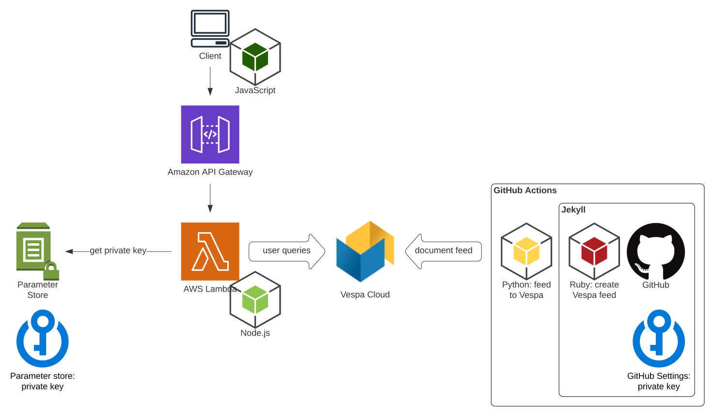

# Vespa Documentation Search

Vespa Cloud instance for searching Vespa documentation.
Serves both Vespa open source and (coming soon: Vespa Cloud documentation).

## Components

## Document feed automation
Vespa Documentation is stored in GitHub:
* https://github.com/vespa-engine/documentation
* https://github.com/vespa-engine/cloud

Jekyll is used to serve the documentation, it rebuilds at each commit.

A change also triggers GitHub Actions.
The _Build_ step in the workflow uses the Jekyll Generator plugin to build a JSON feed, used in fhe _Feed_ step:
* https://github.com/vespa-engine/documentation/blob/master/.github/workflows/feed.yml
* https://github.com/vespa-engine/documentation/blob/master/_config.yml
* https://github.com/vespa-engine/documentation/blob/master/_plugins/vespa_index_generator.rb

### Security
Vespa Cloud secures endpoints using mTLS. Secrets can be stored in GitHub Settings for a repository. Here, the private key secret is accessed in the GitHub Actions workflow that feeds to Vespa Cloud:
[feed.yml](https://github.com/vespa-engine/documentation/blob/master/.github/workflows/feed.yml)

## Query integration
Query results are open to the internet. To access Vespa Documentation Search, an AWS Lambda function is used to get the private key secret from AWS Parameter Store, then add it to the https request to Vespa Cloud:

The lambda needs AmazonSSMReadOnlyAccess added to its Role to access the Parameter Store.

Note JSON-P being used (_jsoncallback=_) - this simplifies the search result page: [search.html](https://github.com/vespa-engine/documentation/blob/master/search.html).

<!-- ToDo: ref to Vespa JSON interface for this quirk -->

## Status

## Simplified node.js Lambda code
<pre>
'use strict';
const https = require('https')
const AWS = require('aws-sdk')

const publicCert = `-----BEGIN CERTIFICATE-----
MIIFbDCCA1QCCQCTyf46/BIdpDANBgkqhkiG9w0BAQsFADB4MQswCQYDVQQGEwJO
...
NxoOxvYcP8Pnxn8UGILy7sKl3VRQWIMrlOfXK4DEg8EGqeQzlFVScfSdbH0i6gQz
-----END CERTIFICATE-----`;

exports.handler = async (event, context) => {
    console.log('Received event:', JSON.stringify(event, null, 4));
    const query = event.queryStringParameters.query ? event.queryStringParameters.query : '';
    const jsoncallback = event.queryStringParameters.jsoncallback;
    const path = encodeURI(`/search/?jsoncallback=${jsoncallback}&query=${query}&hits=${hits}&ranking=${ranking}`);

    const ssm = new AWS.SSM();
    const privateKeyParam = await new Promise((resolve, reject) => {
        ssm.getParameter({
            Name: 'ThePrivateKey',
            WithDecryption: true
        }, (err, data) => {
            if (err) { return reject(err); }
            return resolve(data);
        });
    });

    var options = {
        hostname: 'vespacloud-docsearch.vespa-team.aws-us-east-1c.public.vespa.oath.cloud',
        port: 443,
        path: path,
        method: 'GET',
        headers: { 'accept': 'application/json' },
        key: privateKeyParam.Parameter.Value,
        cert: publicCert
    }

    var body = '';
    const response = await new Promise((resolve, reject) => {
        const req = https.get(
            options,
            res => {
                res.setEncoding('utf8');
                res.on('data', (chunk) => {body += chunk})
                res.on('end', () => {
                    resolve({
                        statusCode: 200,
                        body: body
                    });
                });
            });
        req.on('error', (e) => {
          reject({
              statusCode: 500,
              body: 'Something went wrong!'
          });
        });
    });
    return response
};
</pre>
